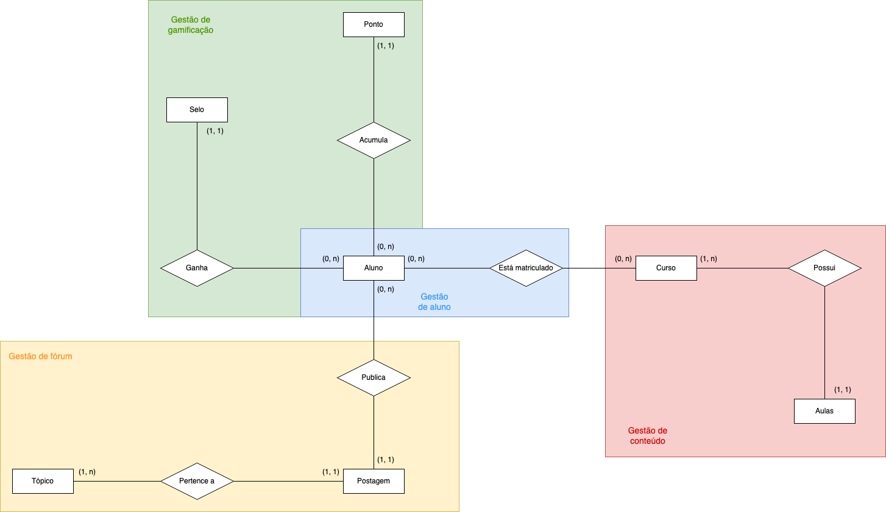

# APIs e Web Services

O planejamento de uma aplicação de APIS Web é uma etapa fundamental para o sucesso do projeto. Ao planejar adequadamente, você pode evitar muitos problemas e garantir que a sua API seja segura, escalável e eficiente.

Aqui estão algumas etapas importantes que devem ser consideradas no planejamento de uma aplicação de APIS Web.

[Inclua uma breve descrição do projeto.]

## Objetivos da API

O primeiro passo é definir os objetivos da sua API. O que você espera alcançar com ela? Você quer que ela seja usada por clientes externos ou apenas por aplicações internas? Quais são os recursos que a API deve fornecer?

[Inclua os objetivos da sua api.]


## Modelagem da Aplicação
[Descreva a modelagem da aplicação, incluindo a estrutura de dados, diagramas de classes ou entidades, e outras representações visuais relevantes.]


Diagrama de Entidade Relacionamento com domínios dos serviços


## Tecnologias Utilizadas

Existem muitas tecnologias diferentes que podem ser usadas para desenvolver APIs Web. A tecnologia certa para o seu projeto dependerá dos seus objetivos, dos seus clientes e dos recursos que a API deve fornecer.

[Lista das tecnologias principais que serão utilizadas no projeto.]

## API Endpoints

### BadgeService

#### **POST /badges** - Criar badge
> Cria um novo badge.

**Request Body**
```json
{
  "name": "test",
  "imgUrl": "test"
}
```

**Responses**
- `201 Created`: Badge criado com sucesso.

---

#### **GET /badges** - Listar badges
> Retorna todos os badges disponíveis.

**Responses**
- `200 OK`: Lista de badges.

---

#### **GET /badges/{id}** - Buscar badge por ID
> Retorna um badge específico.

**Path Parameters**
- `id`: ID do badge (ex: `2`)

**Responses**
- `200 OK`: Badge encontrado.
- `404 Not Found`: Badge não encontrado.

---

#### **PUT /badges/{id}** - Atualizar badge
> Atualiza um badge existente.

**Request Body**
```json
{
  "name": "Química",
  "imgUrl": "/images/badges/flask.png"
}
```

**Responses**
- `200 OK`: Badge atualizado.
- `404 Not Found`: Badge não encontrado.

---

#### **DELETE /badges/{id}** - Remover badge
> Remove um badge.

**Responses**
- `204 No Content`: Badge removido.
- `404 Not Found`: Badge não encontrado.

---

### StudentPointsService

#### **GET /points** - Ranking de pontos
> Lista todos os estudantes ordenados por pontos.

**Responses**
- `200 OK`: Lista de ranking de pontos.

---

#### **GET /points/{id}** - Pontos de um estudante
> Retorna os pontos de um estudante específico.

**Responses**
- `200 OK`: Dados do estudante.
- `404 Not Found`: Estudante não encontrado.

---

#### **PUT /points/{id}** - Atualizar pontos
> Atualiza os pontos de um estudante.

**Request Body**
```json
{
  "points": "200"
}
```

**Responses**
- `200 OK`: Pontos atualizados.
- `404 Not Found`: Estudante não encontrado.

---

#### **DELETE /points/{id}** - Limpar pontos
> Zera os pontos de um estudante.

**Responses**
- `204 No Content`: Pontos resetados.
- `404 Not Found`: Estudante não encontrado.

---

### StudentBadgeService

#### **POST /studentBadge** - Atribuir badge ao estudante
> Atribui um badge a um estudante.

**Query Params**
- `studentId`: ID do estudante
- `badgeId`: ID do badge

**Responses**
- `201 Created`: Badge atribuído.
- `404 Not Found`: Estudante ou badge não encontrado.

---

#### **GET /studentBadge** - Listar badges de um estudante
> Retorna todos os badges de um estudante.

**Query Params**
- `studentId`: ID do estudante

**Responses**
- `200 OK`: Lista de badges.

---

#### **DELETE /studentBadge** - Remover badge do estudante
> Remove um badge atribuído a um estudante.

**Query Params**
- `studentId`: ID do estudante
- `badgeId`: ID do badge

**Responses**
- `204 No Content`: Remoção concluída.

---

### LessonService

#### **GET /lessons** - Listar aulas
> Retorna todas as aulas.

**Responses**
- `200 OK`: Lista de aulas.

---

#### **POST /lessons** - Criar aula
> Cria uma nova aula.

**Request Body**
```json
{
  "name": "teste 1",
  "description": "teste",
  "videoUrl": "teste"
}
```

**Responses**
- `201 Created`: Aula criada.

---

#### **GET /lessons/{id}** - Buscar aula por ID
> Retorna uma aula específica.

**Responses**
- `200 OK`: Aula encontrada.
- `404 Not Found`: Aula não encontrada.

---

#### **PUT /lessons/{id}** - Atualizar aula
> Atualiza dados de uma aula.

**Request Body**
```json
{
  "name": "teste put",
  "description": "put",
  "videoUrl": "put"
}
```

**Responses**
- `200 OK`: Aula atualizada.
- `404 Not Found`: Aula não encontrada.

---

#### **DELETE /lessons/{id}** - Remover aula
> Remove uma aula específica.

**Responses**
- `204 No Content`: Aula removida.
- `404 Not Found`: Aula não encontrada.

---

## LessonService

### `GET /lessons`
> Lista todas as aulas.

---

### `POST /lessons`
> Cria uma nova aula.

**Request Body:**
```json
{
  "name": "teste 1",
  "description": "teste",
  "videoUrl": "teste"
}
```

---

### `GET /lessons/{id}`
> Retorna dados da aula a partir do ID.

---

### `PUT /lessons/{id}`
> Atualiza a aula a partir do ID.

**Request Body:**
```json
{
  "name": "teste put",
  "description": "put",
  "videoUrl": "put"
}
```

---

### `DELETE /lessons/{id}`
> Remove a aula a partir do ID

---

## CourseService

### `GET /courses`
> Lista todos os cursos.

**Responses**
- `200 OK`: Lista de cursos.

---

### `DELETE /courses?courseId={courseId}&lessonId={lessonId}`
> Remove uma aula de um curso.

**Responses**
- `204 No Content`: Curso atualizado.
- `404 Not Found`: Aula não encontrada.
- `404 Not Found`: Curso não encontrado.

---

### `DELETE /courses/{id}`
> Exclui o curso a partir do ID.

**Responses**
- `204 No Content`: Curso removido.
- `404 Not Found`: Curso não encontrado.

---

### `PUT /courses?courseId={courseId}&lessonId={lessonId}`
> Adiciona uma aula a um curso.

**Responses**
- `204 No Content`: Curso atualizado.
- `404 Not Found`: Aula não encontrada.
- `404 Not Found`: Curso não encontrado.

---

### `GET /courses/{id}`
> Retorna dados do curso a partir do ID.

**Response Body**
```json
{
    "id": 10,
    "name": "teste",
    "description": "teste",
    "coverImgUrl": "teste",
    "lessons": [
            {
        "id": 1,
        "name": "teste 1",
        "description": "teste",
        "videoUrl": "teste"
      }
    ]
}
```
---

### `POST /courses/`
> Cria um novo curso.

**Request Body:**
```json
{
  "name": "teste",
  "description": "teste",
  "coverImgUrl": "teste",
  "lessons": []
}
```
**Responses**
- `200 OK`: Curso criado.


---

### `PUT /courses/{id}`
> Atualiza o curso a partir do ID.

**Request Body:**
```json
{
  "name": "teste",
  "description": "teste",
  "coverImgUrl": "teste",
  "lessons": []
}
```
**Responses**
- `200 OK`: Curso atualizado.
- `404 Not Found`: Curso não encontrada.


## Considerações de Segurança

[Discuta as considerações de segurança relevantes para a aplicação distribuída, como autenticação, autorização, proteção contra ataques, etc.]

## Implantação

[Instruções para implantar a aplicação distribuída em um ambiente de produção.]

1. Defina os requisitos de hardware e software necessários para implantar a aplicação em um ambiente de produção.
2. Escolha uma plataforma de hospedagem adequada, como um provedor de nuvem ou um servidor dedicado.
3. Configure o ambiente de implantação, incluindo a instalação de dependências e configuração de variáveis de ambiente.
4. Faça o deploy da aplicação no ambiente escolhido, seguindo as instruções específicas da plataforma de hospedagem.
5. Realize testes para garantir que a aplicação esteja funcionando corretamente no ambiente de produção.

## Testes

## BadgeService

### Criar badge
- **Método:** POST `/badges`
- **Caso de teste 1:** Criar badge com dados válidos
  - Entrada: `{ "name": "Badge Teste", "imgUrl": "https://img.com/badge.png" }`
  - Esperado: 201 Created, body com badge criado

- **Caso de teste 2:** Criar badge com dados ausentes
  - Entrada: `{ "name": "", "imgUrl": "" }`
  - Esperado: 400 Bad Request

---

### Buscar todos os badges
- **Método:** GET `/badges`
- **Caso de teste 1:** Buscar com badges cadastrados
  - Esperado: 200 OK, lista de badges

- **Caso de teste 2:** Buscar sem nenhum badge cadastrado
  - Esperado: 200 OK, lista vazia

---

### Buscar badge por ID
- **Método:** GET `/badges/{id}`
- **Caso de teste 1:** ID existente
  - Entrada: `/badges/1`
  - Esperado: 200 OK, badge correspondente

- **Caso de teste 2:** ID inexistente
  - Entrada: `/badges/999`
  - Esperado: 404 Not Found

---

### Atualizar badge
- **Método:** PUT `/badges/{id}`
- **Caso de teste 1:** Atualizar badge com dados válidos
  - Entrada: `{ "name": "Novo Nome", "imgUrl": "/img/nova.png" }`
  - Esperado: 200 OK, badge atualizado

- **Caso de teste 2:** Atualizar badge inexistente
  - Esperado: 404 Not Found

---

### Deletar badge
- **Método:** DELETE `/badges/{id}`
- **Caso de teste 1:** Badge existente
  - Entrada: `/badges/1`
  - Esperado: 204 No Content

- **Caso de teste 2:** Badge inexistente
  - Entrada: `/badges/999`
  - Esperado: 404 Not Found

---

## StudentPointsService

### Ranking de pontos
- **Método:** GET `/points`
- **Caso de teste 1:** Retornar ranking com dados
  - Esperado: 200 OK, lista ordenada de estudantes

---

### Buscar pontos por ID
- **Método:** GET `/points/{id}`
- **Caso de teste 1:** Estudante existente
  - Entrada: `/points/1`
  - Esperado: 200 OK

- **Caso de teste 2:** Estudante inexistente
  - Entrada: `/points/999`
  - Esperado: 404 Not Found

---

### Atualizar pontos
- **Método:** PUT `/points/{id}`
- **Caso de teste 1:** Atualização válida
  - Entrada: `{ "points": "200" }`
  - Esperado: 200 OK, pontos atualizados

---

### Zerar pontos
- **Método:** DELETE `/points/{id}`
- **Caso de teste 1:** Estudante existente
  - Esperado: 204 No Content

---

## StudentBadgeService

### Atribuir badge ao estudante
- **Método:** POST `/studentBadge?studentId=2&badgeId=1`
- **Caso de teste 1:** Badge e estudante válidos
  - Esperado: 201 Created

---

### Buscar badges de um estudante
- **Método:** GET `/studentBadge?studentId=2`
- **Caso de teste 1:** Estudante com badges
  - Esperado: 200 OK

---

### Remover badge de estudante
- **Método:** DELETE `/studentBadge?studentId=2&badgeId=1`
- **Caso de teste 1:** Badge atribuído
  - Esperado: 204 No Content

---

## LessonService

### Criar aula
- **Método:** POST `/lessons`
- **Caso de teste 1:** Aula válida
  - Entrada: `{ "name": "Aula X", "description": "Conteúdo", "videoUrl": "link" }`
  - Esperado: 201 Created

---

### Buscar aulas
- **Método:** GET `/lessons`
- **Esperado:** 200 OK

---

### Atualizar aula
- **Método:** PUT `/lessons/{id}`
- **Caso de teste:** Atualização válida
  - Esperado: 200 OK

---

### Remover aula
- **Método:** DELETE `/lessons/{id}`
- **Esperado:** 204 No Content

---

## CourseService

### Criar curso
- **Método:** POST `/courses`
- **Entrada válida**
  - Esperado: 201 Created

---

### Buscar cursos
- **Método:** GET `/courses`
- **Esperado:** 200 OK

---

### Adicionar aula ao curso
- **Método:** PUT `/courses?courseId=1&lessonId=1`
- **Esperado:** 200 OK

---

### Remover aula do curso
- **Método:** DELETE `/courses?courseId=1&lessonId=1`
- **Esperado:** 204 No Content

---

### Atualizar curso
- **Método:** PUT `/courses/{id}`
- **Esperado:** 200 OK

---

### Remover curso
- **Método:** DELETE `/courses/{id}`
- **Esperado:** 204 No Content

### API Cadastro de usuário 

## Este projeto demonstra o uso da **Identity com Minimal API** no ASP.NET Core para gerenciamento de usuários, autenticação e autorização.


## Tecnologias Utilizadas

- ASP.NET Core 7/8 (Minimal API)
- Identity API Endpoints
- Entity Framework Core
- SQL Server
- Swagger
- CORS

---

## Endpoints Disponíveis

### Endpoints Padrão da Identity

Utilizando `app.MapIdentityApi<User>()`, os seguintes endpoints são registrados automaticamente:

| Método | Rota                  | Descrição                                 |
|--------|-----------------------|-------------------------------------------|
| POST   | `/register`           | Registra um novo usuário                  |
| POST   | `/login`              | Realiza login (gera cookie ou token)      |
| POST   | `/logout`             | Realiza logout                            |
| POST   | `/confirm-email`      | Confirma e-mail do usuário                |
| POST   | `/forgot-password`    | Envia link para redefinir senha           |
| POST   | `/reset-password`     | Redefine senha com token                  |
| POST   | `/change-password`    | Altera senha estando autenticado          |
| GET    | `/me`                 | Retorna informações do usuário logado     |

> ℹEsses endpoints são protegidos ou públicos conforme a configuração padrão da Identity.

---

### 📄 GET `/user`

```csharp
app.MapGet("/user", (ClaimsPrincipal user) => user.Identity!.Name)
    .RequireAuthorization();
Descrição: Retorna o nome do usuário autenticado.

Autenticação: Sim

Resposta:

"usuario@email.com"

🔓 POST /logout
csharp
Copiar
Editar
app.MapPost("/logout",
    async (SignInManager<User> signInManager, [FromBody] object empty) =>
    {
        await signInManager.SignOutAsync();
        return Results.Ok();
    });
Descrição: Faz o logout do usuário.

Autenticação: Sim

Corpo da requisição:


{}
Resposta: 200 OK

👥 GET /MyUser
csharp
Copiar
Editar
app.MapGet("/MyUser", async (UserManager<User> userManager) =>
{
    var users = await userManager.Users.ToListAsync();
    var userDTOs = users.Select(u => new UserDTO { Email = u.Email }).ToList();
    return Results.Ok(userDTOs);
});
Descrição: Retorna a lista de usuários cadastrados (somente e-mails).

Autenticação: ❌ Não (público)

Resposta:

[
  { "email": "exemplo1@email.com" },
  { "email": "exemplo2@email.com" }
]


Configurações
Banco de Dados
O projeto utiliza SQL Server. A string de conexão está definida assim:


"Server=localhost,1433;Database=identity-db;User Id=sa;Password=Pedro_1987;Trusted_Connection=false;TrustServerCertificate=true;"


CORS
As requisições de qualquer origem são permitidas:


builder.Services.AddCors(options =>
{
    options.AddDefaultPolicy(builder =>
    {
        builder.AllowAnyOrigin().AllowAnyHeader().AllowAnyMethod();
    });
});

# Referências

Inclua todas as referências (livros, artigos, sites, etc) utilizados no desenvolvimento do trabalho.
