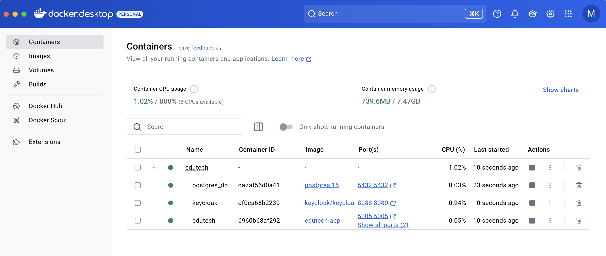
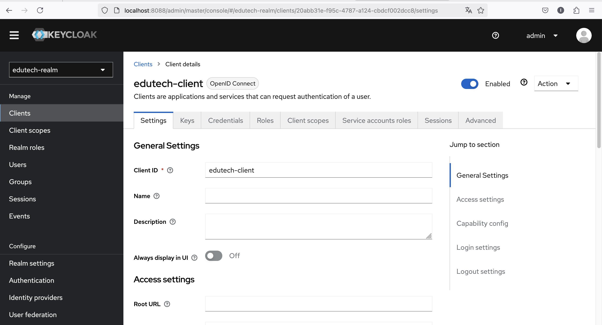
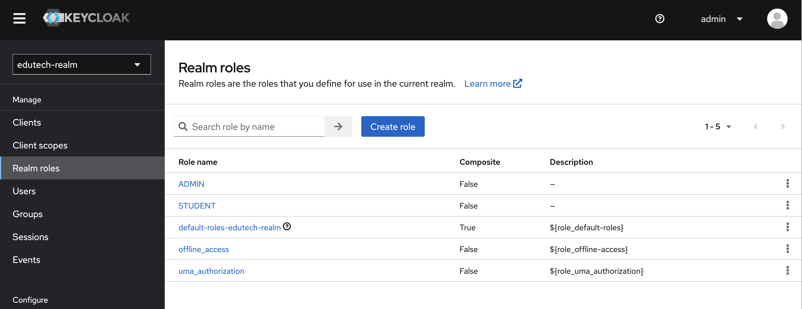
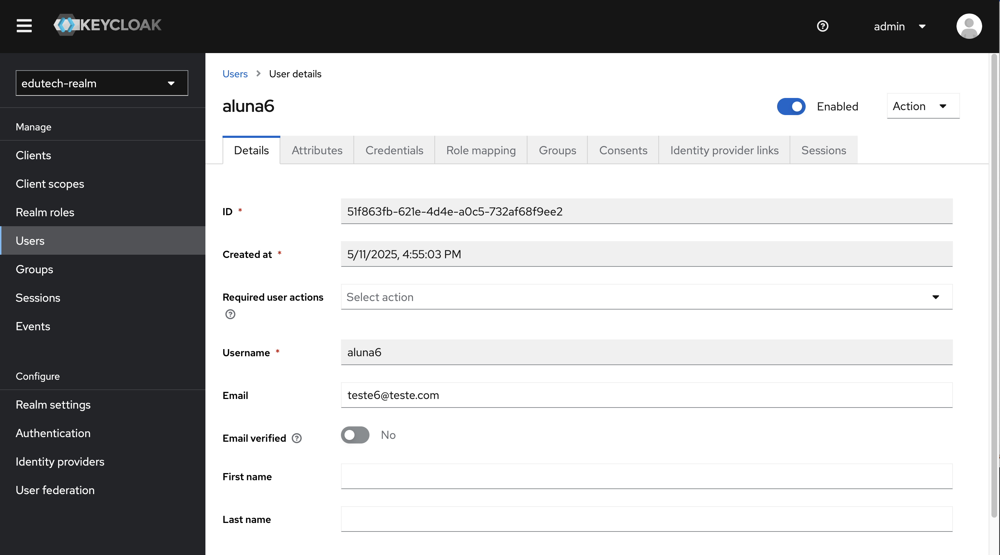
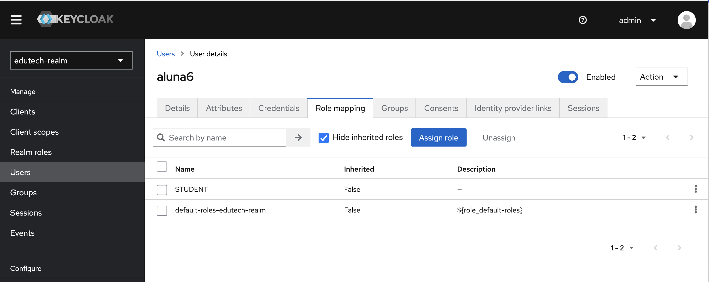
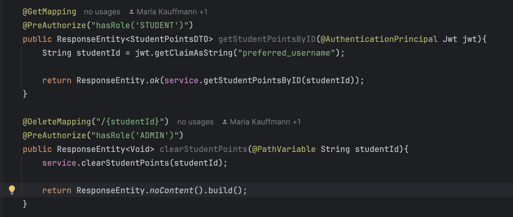

# APIs e Web Services

As APIs do projeto Edutech visam prover o gerenciamento das principais entidades do sistema, com autenticação de usuários e autorização com segregação de funções por roles. As entidades gerenciadas são: Badge, StudentPoints, StudentBadge, Lesson, Course, Enrollment, LessonProgress e serviços de criação e autenticação de usuários.

## Objetivos da API
O Objetivo da API é prover o backend do sistema de maneira segura, escalável e desacoplada.


## Modelagem da Aplicação


Diagrama de Entidade Relacionamento com domínios dos serviços


## Tecnologias Utilizadas

 As APIs foram desenvolvidas com o framework Spring Boot baseado em Java, banco de dados PostgreSQL, autenticação e autorização gerenciadas pelo Keycloak e infraestrutura provida pelo Docker. Os testes das API foram feitos através do software Postman.

 
 Container rodando no Docker Desktop

## API Endpoints

## 🏅 BadgeService

### 🔸 Create a Badge
- **Endpoint:** `POST /badges`
- **Auth:** Bearer Token - ADMIN
- **Body (JSON):**
  ```json
  {
    "name": "test",
    "imgUrl": "test"
  }
  ```

### 🔸 Get All Badges
- **Endpoint:** `GET /badges`
- **Auth:** -

### 🔸 Get Badge by ID
- **Endpoint:** `GET /badges/{id}`
- **Auth:** -

### 🔸 Update a Badge
- **Endpoint:** `PUT /badges/{id}`
- **Auth:** Bearer Token - ADMIN
- **Body (JSON):**
  ```json
  {
    "name": "Química",
    "imgUrl": "/images/badges/flask.png"
  }
  ```

### 🔸 Delete a Badge
- **Endpoint:** `DELETE /badges/{id}`
- **Auth:** Bearer Token - ADMIN

---

## 🎯 StudentPointsService

### 🔸 Get Points Ranking
- **Endpoint:** `GET /points/ranking`
- **Auth:** -

### 🔸 Get Student Points (Authenticated Student)
- **Endpoint:** `GET /points`
- **Auth:** Bearer Token - STUDENT

### 🔸 Update Student Points
- **Endpoint:** `PUT /points`
- **Auth:** Bearer Token - STUDENT
- **Body (JSON):**
  ```json
  {
    "points": "100"
  }
  ```

### 🔸 Clear Student Points by Email
- **Endpoint:** `DELETE /points/{studentEmail}`
- **Auth:** Bearer Token - ADMIN

---

## 🧑‍🎓 StudentBadgeService

### 🔸 Assign Badge to Student
- **Endpoint:** `POST /studentBadge?badgeId={id}`
- **Auth:** Bearer Token - STUDENT

### 🔸 Get All Badges Assigned to Student
- **Endpoint:** `GET /studentBadge`
- **Auth:** Bearer Token - STUDENT

### 🔸 Remove Badge from Student
- **Endpoint:** `DELETE /studentBadge?studentId={id}&badgeId={id}`
- **Auth:** Bearer Token - ADMIN

---

## 📚 LessonService

### 🔸 Get All Lessons
- **Endpoint:** `GET /lessons`
- **Auth:** -

### 🔸 Create Lesson
- **Endpoint:** `POST /lessons`
- **Auth:** -
- **Body (JSON):**
  ```json
  {
    "name": "teste 2",
    "description": "teste",
    "videoUrl": "teste"
  }
  ```

### 🔸 Get Lesson by ID
- **Endpoint:** `GET /lessons/{id}`
- **Auth:** -

### 🔸 Update Lesson
- **Endpoint:** `PUT /lessons/{id}`
- **Auth:** Bearer Token - ADMIN
- **Body (JSON):**
  ```json
  {
    "name": "teste put",
    "description": "put",
    "videoUrl": "put"
  }
  ```

### 🔸 Delete Lesson
- **Endpoint:** `DELETE /lessons/{id}`
- **Auth:** Bearer Token - ADMIN

---

## 🏫 CourseService

### 🔸 Get All Courses
- **Endpoint:** `GET /courses`
- **Auth:** -

### 🔸 Get Course by ID
- **Endpoint:** `GET /courses/{id}`
- **Auth:** -

### 🔸 Create Course
- **Endpoint:** `POST /courses`
- **Auth:** Bearer Token - ADMIN
- **Body (JSON):**
  ```json
  {
    "name": "teste",
    "description": "teste",
    "coverImgUrl": "teste",
    "lessons": []
  }
  ```

### 🔸 Update Course Info
- **Endpoint:** `PUT /courses/{id}`
- **Auth:** Bearer Token - ADMIN

### 🔸 Delete Course
- **Endpoint:** `DELETE /courses/{id}`
- **Auth:** Bearer Token - ADMIN

### 🔸 Add Lesson to Course
- **Endpoint:** `PUT /courses?courseId={id}&lessonId={id}`
- **Auth:** Bearer Token - ADMIN

### 🔸 Remove Lesson from Course
- **Endpoint:** `DELETE /courses?courseId={id}&lessonId={id}`
- **Auth:** Bearer Token - ADMIN

---

## 🧭 LessonProgressService

### 🔸 Mark Lesson as Watched
- **Endpoint:** `POST /lessonProgress`
- **Auth:** Bearer Token - STUDENT

---

### 🔸 Get Lesson Progress
- **Endpoint:** `GET /lessonProgress`
- **Auth:** Bearer Token - STUDENT

---

## 📝 EnrollmentService

### 🔸 Enroll Student in Course
- **Endpoint:** `POST /enrollment?courseId={id}`
- **Auth:** Bearer Token - STUDENT

---

### 🔸 Get All Enrollments
- **Endpoint:** `GET /enrollment`
- **Auth:** Bearer Token - STUDENT

---

## 🔐 Auth

### 🔸 Login
- **Endpoint:** `POST /login/`
- **Auth:** -
- **Body (JSON):**
  ```json
  {
    "username": "teste_user",
    "password": "teste"
  }
  ```

---

### 🔸 Create User
- **Endpoint:** `POST /users/`
- **Auth:** -
- **Body (JSON):**
  ```json
  {
    "username": "aluna",
    "password": "teste",
    "email": "teste3@teste2"
  }
  ```


## Considerações de Segurança

A principal implementação de segurança foi o estabelecimento de rotas autenticadas com diferententes níveis de autorização, constrolados pelas roles STUDENT e ADMIN, gerenciadas na plataforma Keycloak. A implementação é feita a nível de API pelas dependências Spring Boot Security e Spring Boot Oauth2 Resource Server, que implementam a gestão de tokens JWT de maneira transparente. A seguir, alguns prints da implementação do Keycloak no projeto:


Edutech-realm e edutech-client criados no ambiente local


Roles ADMIN e STUDENT controlam diferentes funcinalidades das APIs


Usuário criado no Keycloak


Usuário com role STUDENT


Serviços com diferentes roles para autorização usando annotation @PreAutorize


## Implantação


Para fazer o build da aplicação:
```
mvn clean install    
```


Para rodar projeto:

```
docker-compose up --build -d
```

API cria apenas usuários estudantes. Para dar permissão admin:

```
- Com o container rodando, acessar keycloak em http://localhost:8088/
- clicar em Administration console
- user admin / senha admin
- trocar para realm edutech-realm
- Clicar em Users na barra lateral
- Escolher um usuário para dar permissão
- Cliar no usuário, aba Role mapping
- Botão Assign Role, selecionar role ADMIN e cliar em assign
- No próximo login, usuário deve ter as permissões para endpoints administrativas
```


## Testes

## BadgeService

### Criar badge
- **Método:** POST `/badges`
- **Caso de teste 1:** Criar badge com dados válidos
  - Entrada: `{ "name": "Badge Teste", "imgUrl": "https://img.com/badge.png" }`
  - Esperado: 201 Created, body com badge criado

- **Caso de teste 2:** Criar badge com dados ausentes
  - Entrada: `{ "name": "", "imgUrl": "" }`
  - Esperado: 400 Bad Request

---

### Buscar todos os badges
- **Método:** GET `/badges`
- **Caso de teste 1:** Buscar com badges cadastrados
  - Esperado: 200 OK, lista de badges

- **Caso de teste 2:** Buscar sem nenhum badge cadastrado
  - Esperado: 200 OK, lista vazia

---

### Buscar badge por ID
- **Método:** GET `/badges/{id}`
- **Caso de teste 1:** ID existente
  - Entrada: `/badges/1`
  - Esperado: 200 OK, badge correspondente

- **Caso de teste 2:** ID inexistente
  - Entrada: `/badges/999`
  - Esperado: 404 Not Found

---

### Atualizar badge
- **Método:** PUT `/badges/{id}`
- **Caso de teste 1:** Atualizar badge com dados válidos
  - Entrada: `{ "name": "Novo Nome", "imgUrl": "/img/nova.png" }`
  - Esperado: 200 OK, badge atualizado

- **Caso de teste 2:** Atualizar badge inexistente
  - Esperado: 404 Not Found

---

### Deletar badge
- **Método:** DELETE `/badges/{id}`
- **Caso de teste 1:** Badge existente
  - Entrada: `/badges/1`
  - Esperado: 204 No Content

- **Caso de teste 2:** Badge inexistente
  - Entrada: `/badges/999`
  - Esperado: 404 Not Found

---

## StudentPointsService

### Ranking de pontos
- **Método:** GET `/points`
- **Caso de teste 1:** Retornar ranking com dados
  - Esperado: 200 OK, lista ordenada de estudantes

---

### Buscar pontos por ID
- **Método:** GET `/points/{id}`
- **Caso de teste 1:** Estudante existente
  - Entrada: `/points/1`
  - Esperado: 200 OK

- **Caso de teste 2:** Estudante inexistente
  - Entrada: `/points/999`
  - Esperado: 404 Not Found

---

### Atualizar pontos
- **Método:** PUT `/points/{id}`
- **Caso de teste 1:** Atualização válida
  - Entrada: `{ "points": "200" }`
  - Esperado: 200 OK, pontos atualizados

---

### Zerar pontos
- **Método:** DELETE `/points/{id}`
- **Caso de teste 1:** Estudante existente
  - Esperado: 204 No Content

---

## StudentBadgeService

### Atribuir badge ao estudante
- **Método:** POST `/studentBadge?studentId=2&badgeId=1`
- **Caso de teste 1:** Badge e estudante válidos
  - Esperado: 201 Created

---

### Buscar badges de um estudante
- **Método:** GET `/studentBadge?studentId=2`
- **Caso de teste 1:** Estudante com badges
  - Esperado: 200 OK

---

### Remover badge de estudante
- **Método:** DELETE `/studentBadge?studentId=2&badgeId=1`
- **Caso de teste 1:** Badge atribuído
  - Esperado: 204 No Content

---

## LessonService

### Criar aula
- **Método:** POST `/lessons`
- **Caso de teste 1:** Aula válida
  - Entrada: `{ "name": "Aula X", "description": "Conteúdo", "videoUrl": "link" }`
  - Esperado: 201 Created

---

### Buscar aulas
- **Método:** GET `/lessons`
- **Esperado:** 200 OK

---

### Atualizar aula
- **Método:** PUT `/lessons/{id}`
- **Caso de teste:** Atualização válida
  - Esperado: 200 OK

---

### Remover aula
- **Método:** DELETE `/lessons/{id}`
- **Esperado:** 204 No Content

---

## CourseService

### Criar curso
- **Método:** POST `/courses`
- **Entrada válida**
  - Esperado: 201 Created

---

### Buscar cursos
- **Método:** GET `/courses`
- **Esperado:** 200 OK

---

### Adicionar aula ao curso
- **Método:** PUT `/courses?courseId=1&lessonId=1`
- **Esperado:** 200 OK

---

### Remover aula do curso
- **Método:** DELETE `/courses?courseId=1&lessonId=1`
- **Esperado:** 204 No Content

---

### Atualizar curso
- **Método:** PUT `/courses/{id}`
- **Esperado:** 200 OK

---

### Remover curso
- **Método:** DELETE `/courses/{id}`
- **Esperado:** 204 No Content

