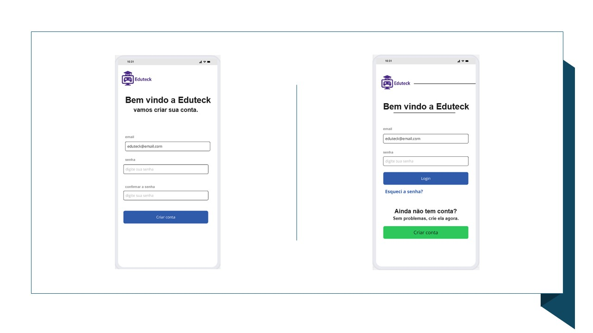
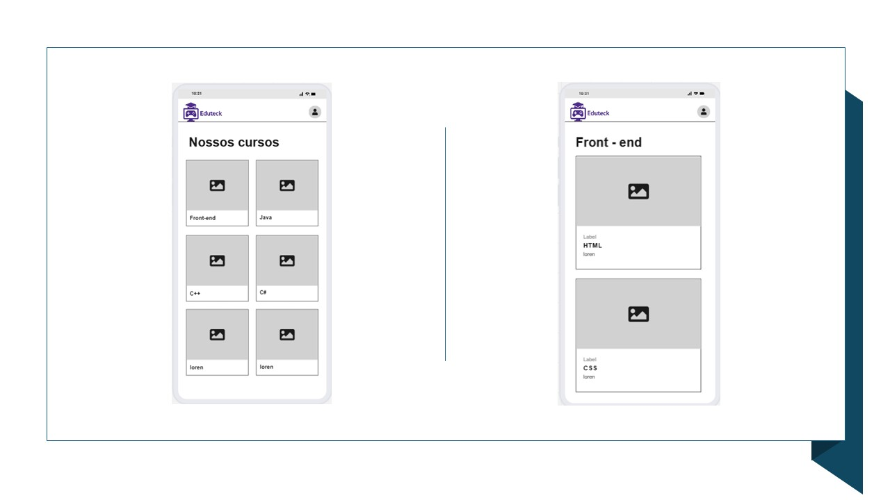
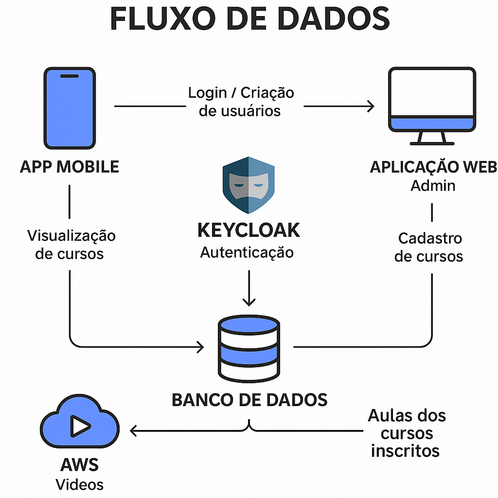

# Front-end Móvel

O aplicativo mobile contará com uma página de login, onde o usuário poderá criar uma conta ou acessar uma já existente. É através do aplicativo também que o usuário poderá se inscrever e ver as aulas.

## Projeto da Interface

### Wireframes

### Design Visual

# Cores

Cor usada no header e outras divs principais das paginas  #98BFE5.

Cor usada nos textos e titulos  #212529.

Cor usada no footer  #101D42.

Cor usada nos textos do footer  #6F8FB4.

Cor usada nos textos secundarios do footer e botões  #F4D35E.

# Fontes

Arial usado em todos os texto das telas de login. Wight 700 e 400

OpenSans usado em botões.

Bangers usado na parte da pagina de gameficação.

## Fluxo de Dados

## Tecnologias Utilizadas

Expo Dev;

React Native;

AWS;

## Considerações de Segurança

[Discuta as considerações de segurança relevantes para a aplicação distribuída, como autenticação, autorização, proteção contra ataques, etc.]

## Implantação

### Requisitos de Hardware e Software

1. Para rodar a aplicação em ambiente de produção, foi necessário:
* Um celular ou emulador Android/iOS para o app mobile;
* Backend com suporte a Node.js;
* Banco de dados relacional;
* Keycloak rodando em container Docker ou servidor com suporte Java;
* Armazenamento S3 da AWS para os vídeos dos cursos.

2. Escolha da Plataforma de Hospedagem
Para a implantação, foram escolhidas as seguintes plataformas:
* Keycloak;
* AWS S3 para o armazenamento de vídeos;
* O app mobile é distribuído via Expo, que permite rodar diretamente em aparelhos físicos;

3. Configuração do Ambiente de Implantação
Foi necessário configurar variáveis de ambiente no backend, como:
* URLs do Keycloak;
* Conexão com o banco de dados;
* Caminhos de acesso aos vídeos da AWS S3;
* Além disso, instalamos as dependências com npm install e configuramos o arquivo app.json no projeto Expo para o ambiente de produção.

4. Deploy da Aplicação
* O Keycloak foi rodado em um container Docker e configurado com os clientes.
* O app mobile foi publicado utilizando o comando npx expo export, com a possibilidade de depois gerar os arquivos .apk ou .aab para publicação nas lojas.

5. Testes no Ambiente de Produção
Após o deploy, foram realizados testes de:

* Login e criação de usuários via Keycloak;
* Visualização de cursos no app mobile;
* Requisições à API e carregamento de vídeos da AWS;
* Fluxo completo de cadastro de cursos pela aplicação web e exibição no app.

## Testes

[Assista ao vídeo](./img/VideoTeste.mp4)

# Referências

Inclua todas as referências (livros, artigos, sites, etc) utilizados no desenvolvimento do trabalho.
