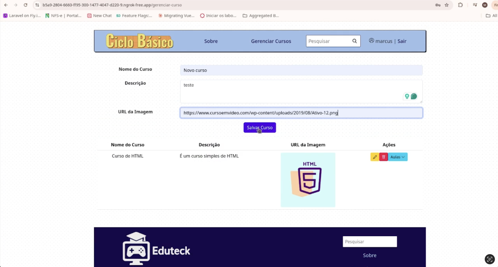

# Front-end Web

Na etapa do Front-end Web, fechamos o escopo da aplicação para um portal administrativo, integrando as APIs que demandam privilégios administrativos e gerenciam o conteúdo da plataforma: criação, edição e exclusão de cursos e aulas.

## Projeto da Interface Web

[Descreva o projeto da interface Web da aplicação, incluindo o design visual, layout das páginas, interações do usuário e outros aspectos relevantes.]

### Wireframes

## Pagina inicial

## Pagina Sobre

## Pagina gerenciar cursos

## Pagina Login

### Design Visual

[Descreva o estilo visual da interface, incluindo paleta de cores, tipografia, ícones e outros elementos gráficos.]

## Fluxo de Dados

[Diagrama ou descrição do fluxo de dados na aplicação.]

## Tecnologias Utilizadas
- HTML
- CSS
- JavaScript
- Vue.js

## Considerações de Segurança

A autenticação dos usuários é realizada por meio do login com e-mail e senha, onde o Keycloak atua como provedor de identidade, emitindo um token de acesso (JWT) após a validação das credenciais. Esse token é então utilizado pelo front-end para acessar recursos protegidos nas APIs, garantindo que apenas usuários autenticados e devidamente autorizados tenham permissão para consumir os dados ou realizar ações específicas.

Além disso, foram aplicadas configurações de CORS (Cross-Origin Resource Sharing) nas APIs, permitindo que o front-end se comunique com os serviços de backend de forma segura, mesmo estando hospedado em domínios distintos.

Essas medidas em conjunto asseguram uma comunicação segura entre o front-end e o backend, protegendo tanto os dados dos usuários quanto a integridade da aplicação como um todo.

## Testes
Testes de integração realizados com a identidade visual ainda incompleta.

### CT 1 - Login com usuário administrativo - OK

**DADO QUE** um usuário possui nome de usuário e senha

**E** privilégios administrativos

**QUANDO** ele fizer o login

**ENTÃO** ele será direcionado para a área de gestão de cursos e aulas

---

### CT 2 - Listar cursos - OK

**DADO QUE** um usuário está logado

**E** possui privilégios administrativos

**QUANDO** ele acessar a área administrativa

**ENTÃO** ele conseguirá listar todos os cursos cadastrados

!

---

### CT 3 - Excluir curso - OK

**DADO QUE** um usuário está logado

**E** possui privilégios administrativos

**QUANDO** ele clicar no botão exlcuir curso

**E** confirmar

**ENTÃO** o curso será excluído

---

### CT 4 - Criar curso - OK

**DADO QUE** um usuário está logado

**E** possui privilégios administrativos

**QUANDO** ele preencher os dados de um novo curso

**E** clicar no botão Salvar Curso

**ENTÃO** o curso será criado

---

### CT 5 - Cadastrar aula - OK

**DADO QUE** um usuário está logado

**E** possui privilégios administrativos

**QUANDO** ele clicar para ver as aulas de um curso

**E** preencher os dados de uma nova aula

**ENTÃO** a aula será criada relacionada ao curso selecionado

---

### CT 6 - Excluir aula - OK

**DADO QUE** um usuário está logado

**E** possui privilégios administrativos

**QUANDO** ele listar as aulas de um curso

**E** clicar no botão excluir

**E** confirmar

**ENTÃO** a aula será excluída deste curso

---

### CT 7 - Editar curso - OK

**DADO QUE** um usuário está logado

**E** possui privilégios administrativos

**QUANDO** ele listar os cursos

**E** clicar no botão editar

**E** preencher novos dados

**E** clicar no botão salvar

**ENTÃO** o curso será atualizado

---

### CT 8 - Exibir página Sobre - OK

**DADO QUE** um usuário está acessando o site

**QUANDO** ele clicar no menu Sobre no Header

**ENTÃO** será exibida uma página com dados estáticos

---

